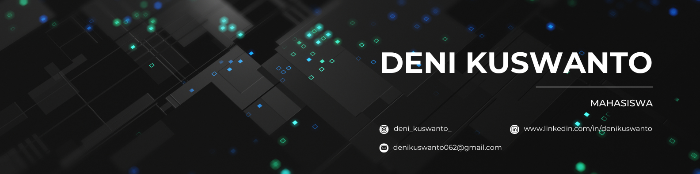

## Hallo! I'm Deni Kuswanto👋

<!--
**deni-kuswanto/deni-kuswanto** is a ✨ _special_ ✨ repository because its `README.md` (this file) appears on your GitHub profile.

Here are some ideas to get you started:

- 🔭 I’m currently working on ...
- 🌱 I’m currently learning ...
- 👯 I’m looking to collaborate on ...
- 🤔 I’m looking for help with ...
- 💬 Ask me about ...
- 📫 How to reach me: ...
- 😄 Pronouns: ...
- ⚡ Fun fact: ...
-->

- 🏫 I’m currently studying on [**Universitas Negeri Surabaya**](https://unesa.ac.id/)
- 🌱 I’m currently learning [**c++**](https://devdocs.io/cpp/), [**python**](https://www.python.org/)

##### Skills

             

##### Connect with Me

 

##### My Github Stats

